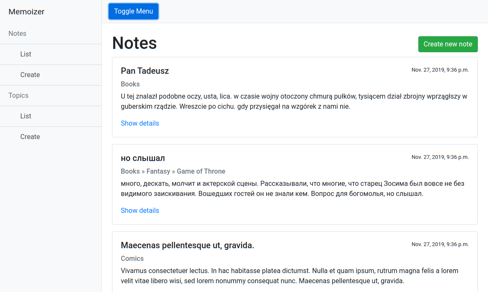
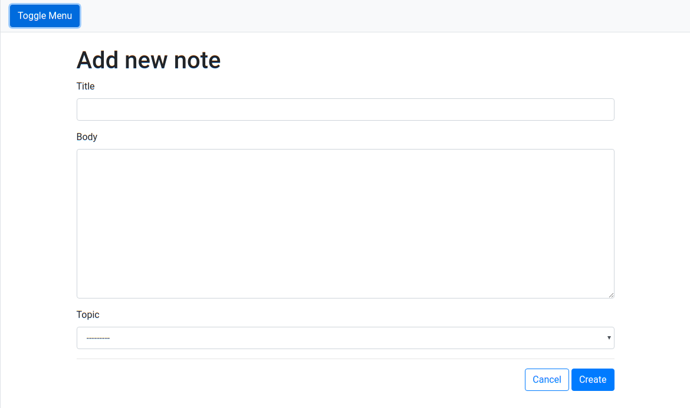
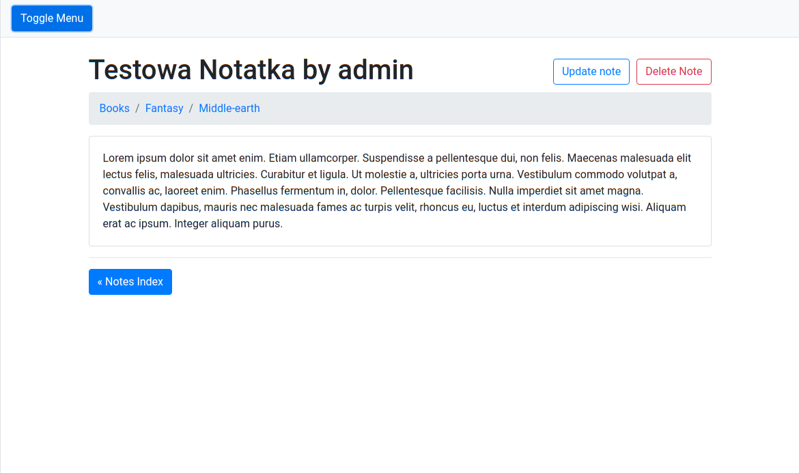
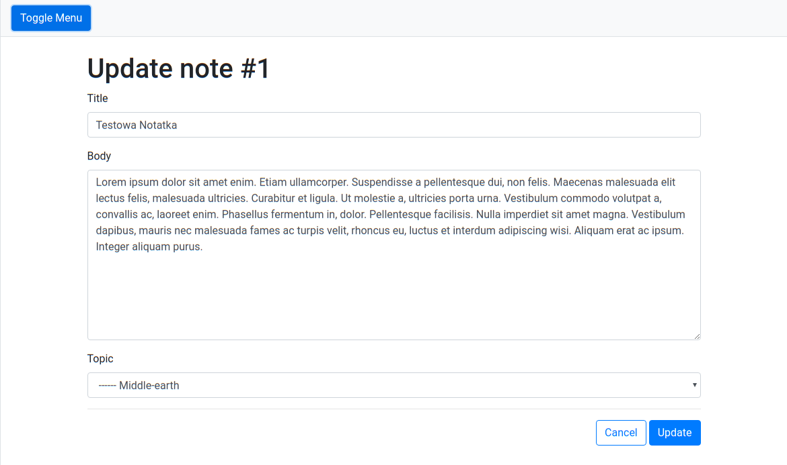
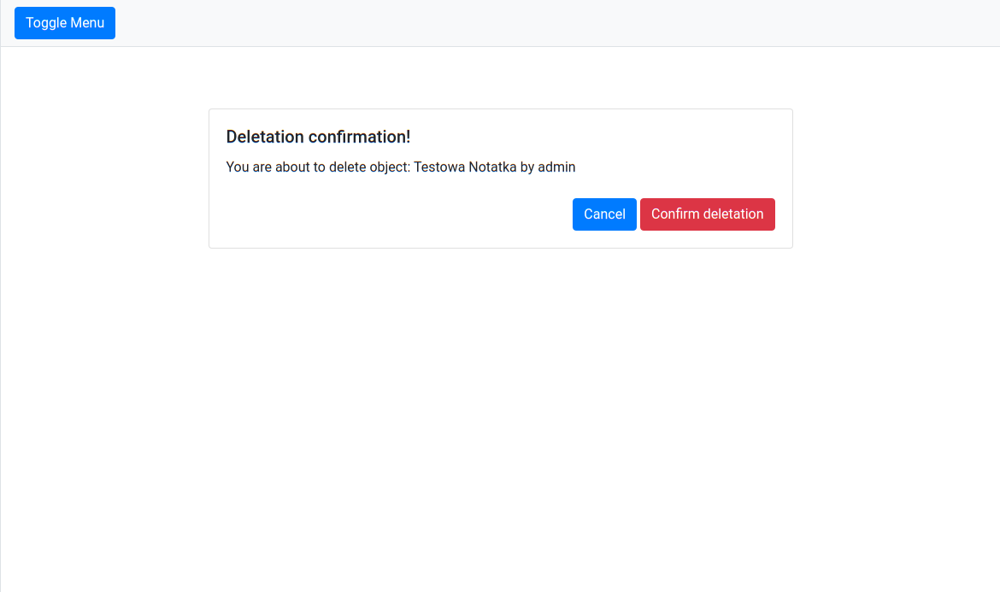
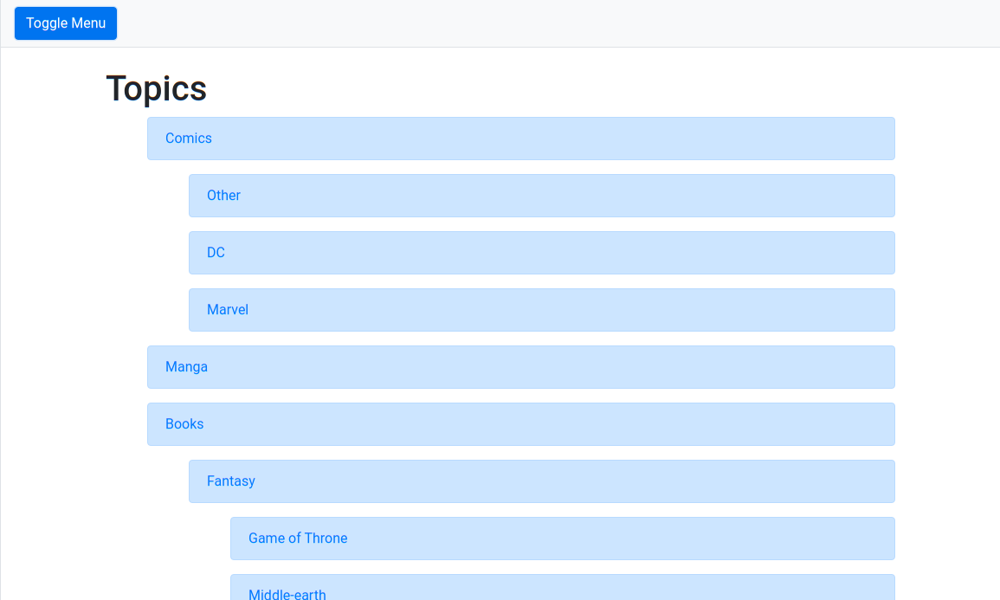
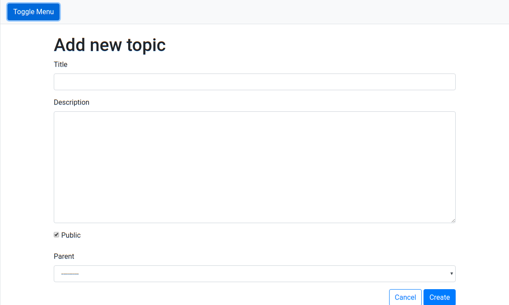
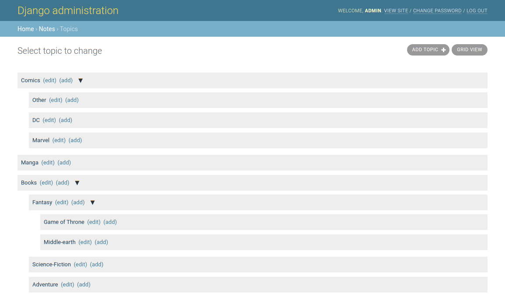

# django-notes-demo

Sample demo app for managing notes.

## Toggle side menu ##

## Notes index ##

## Note creation form ##

## Note details view ##

## Note update form ##

## Note deletation confirm view ##

## Topics index ##

## Topic creation form ##

## Topics tree in Django admin ##

